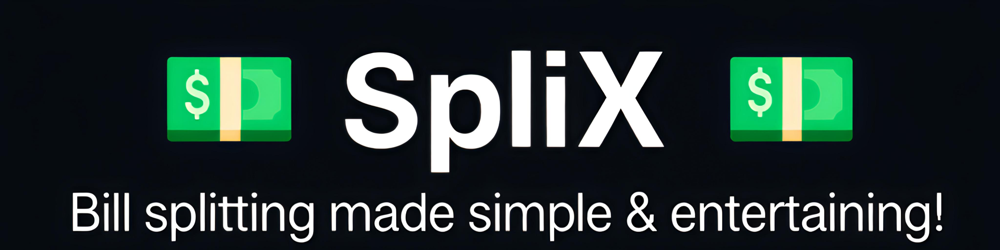

# 💸 SpliX – Bill Splitter

---

## 🌐 Live Demo

Try it here: [SpliX – Bill Splitter](https://rehanrahim7.github.io/SpliX/)

---

## 🎥 Video Demo

[Watch on YouTube](https://youtu.be/fQ752Yosoi8)

---

## 📖 Description

SpliX is a web based application built as my **CS50 Final Project** with the goal of making bill splitting both **practical and fun**. The problem it solves is a very common one: when friends, family, or colleagues go out together, the task of figuring out who owes what often becomes confusing, time consuming, or even awkward. Existing solutions often focus on pure calculation, but SpliX attempts to merge functionality with entertainment by including playful features such as a spinning wheel, dice rolls, and a luck based mode.

At its core, SpliX supports two main ways of splitting costs:

1. **Equal Split** - where the total bill is divided evenly among participants.
2. **Percentage Split** - where custom percentages can be assigned to each person, giving flexibility when expenses aren’t meant to be shared equally.

Beyond splitting costs, the project integrates decision making tools to decide who pays the entire bill if the group chooses a game of chance. For example, the **Spin the Wheel** feature selects a random person in a visually engaging way, complete with colors and sound effects. The **Dice Roll** and **Luck Mode** provide simpler but equally fun alternatives.

---

## ✨ Features

* **Equal & Percentage Split** - Divide bills evenly or by custom percentages.
* **Quick Add People** - Easily add participants by typing names (supports Enter key).
* **Randomizers** - Spin the Wheel 🎡, Dice Roll 🎲, and Luck Mode 🎯 to decide who pays.
* **Custom Sounds** - Wheel spin includes sound effects with a winner cue at the end.
* **Dark Mode Toggle** - Switch between light and dark themes for better visibility.
* **UI Cleanup** - Smooth layout with info icons and organized steps.

---

## 🗂️ Project Structure

| Path                           | Purpose                                    |
| ------------------------------ | ------------------------------------------ |
| `index.html`                   | Main HTML page; defines the structure      |
| `style.css`                    | Stylesheet; handles both light and dark UI |
| `script.js`                    | JavaScript logic; all core interactivity   |
| `README.md`                    | Project documentation                      |
| `assets/images/Homepage-1.png` | Screenshot 1                               |
| `assets/images/Homepage-2.png` | Screenshot 2                               |
| `assets/images/Banner.png`     | Banner image                               |
| `assets/wheel-sound.mp3`       | Wheel spin sound effect                    |

---

## 🛠️ Technical Implementation

* **`index.html`**: This file provides the structural foundation. It includes all the form fields for entering participant names, bill amounts, and options for choosing the type of split. It also links to the stylesheet and JavaScript file.

* **`style.css`**: The stylesheet defines the entire look and feel of the application. I designed two themes—light mode and dark mode accessible through a toggle. Extra care was taken to create a clean, modern interface with smooth transitions and easily distinguishable colors. The wheel is also styled here with ten vibrant color slices for clarity and appeal.

* **`script.js`**: This is where the logic lives. JavaScript powers features such as adding new participants dynamically, performing calculations for equal or percentage splits, and triggering animations for the randomizer tools. The spinning wheel uses trigonometric calculations to determine the winning slice, combined with event listeners to synchronize animations and sound effects.

* **Assets**: The project includes images and an MP3 file. The wheel’s spin sound was added to provide auditory feedback, enhancing the user experience.

---

## 👩‍💻 User Experience Flow

1. The user opens the app in a browser.
2. They enter participant names, either typing and pressing Enter or clicking to add.
3. They enter the total bill and select whether to split equally or by percentage.
4. If percentages are chosen, fields appear for manual entry.
5. The app instantly calculates and displays the amounts owed.
6. Optionally, the group can use the randomizer tools:

   * Spin the Wheel for a colorful, suspenseful choice.
   * Roll the Dice for a quick decision.
   * Try Luck Mode for a surprise outcome.
7. Users can toggle between light and dark modes for comfort.

---

## ⚖️ Design Decisions & Challenges

* **Simplicity vs. Feature Creep**: I wanted to keep the app lightweight but also engaging. That balance led me to include randomizers as optional features rather than core requirements.
* **Responsiveness**: A challenge was ensuring the layout worked well on both desktop and mobile browsers. CSS media queries and flexible containers solved this.
* **Wheel Mechanics**: Implementing the spinning wheel required calculating degrees of rotation, using easing functions for animation, and mapping results to participant names. This was a complex but rewarding part of development.
* **Accessibility**: Dark mode was added to improve usability for people in low light environments.

---

## 🚀 Future Improvements

* Integration with a **backend and database** to save expenses over time.
* A **login system** so groups can track balances across multiple outings.
* Support for exporting results as **PDF or CSV**.
* Expansion of randomizer tools with customizable themes.
* Mobile first redesign to create a companion app version.

---

## 🎓 Acknowledgements

* Built as part of **CS50 Final Project**.
* Huge thanks to **Prof. David J. Malan** and the entire CS50 team for their incredible teaching and inspiration.
* Inspired by the need to make splitting bills both **simple and fun**.

---
