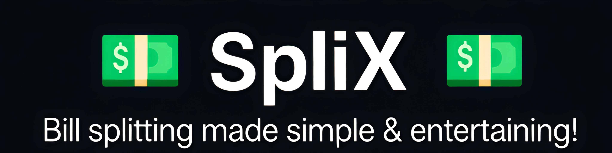
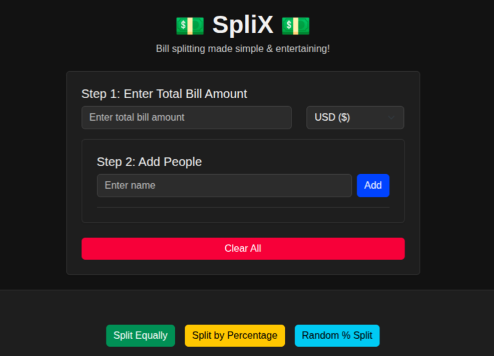
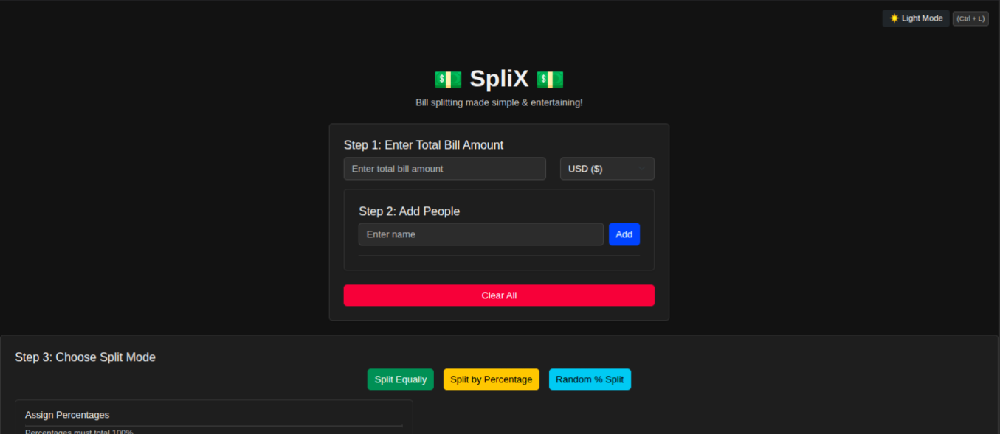

# 💸 SpliX – Bill Splitter



---

## 🌐 Live Demo
Try it here: [SpliX – Bill Splitter](https://rehanrahim7.github.io/SpliX/)

---

## ✨ Features
- **Equal & Percentage Split** – Divide bills evenly or by custom percentages.
- **Quick Add People** – Easily add participants by typing names (supports Enter key).
- **Randomizers** – Spin the Wheel 🎡, Dice Roll 🎲, and Luck Mode 🎯 to decide who pays.
- **Custom Sounds** – Wheel spin includes sound effects with a winner cue at the end.
- **Dark Mode Toggle** – Switch between light and dark themes for better visibility.
- **UI Cleanup** – Smooth layout with info icons and organized steps.

---

## 🗂️ Project Structure
| Path                           | Purpose                 |
| ------------------------------ | ----------------------- |
| `index.html`                   | Main HTML page          |
| `style.css`                    | Stylesheet              |
| `script.js`                    | JavaScript logic        |
| `README.md`                    | Project documentation   |
| `assets/images/Homepage-1.png` | Screenshot 1            |
| `assets/images/Homepage-2.png` | Screenshot 2            |
| `assets/images/Banner.png`     | Banner                  |
| `assets/wheel-sound.mp3`       | Wheel spin sound effect |

---

## 🎨 Wheel Colors
The wheel uses **10 vibrant colors** for an attractive look:
- 🔥 Orange-Red `#FF5733`
- 🌟 Golden Yellow `#FFD700`
- 🍃 Lime Green `#32CD32`
- 💧 Dodger Blue `#1E90FF`
- 💖 Hot Pink `#FF69B4`
- 🎭 Deep Purple `#800080`
- 🌊 Turquoise `#00CED1`
- 🧡 Orange-Red `#FF4500`
- ❤️‍🔥 Dark Red `#8B0000`
- 🌱 Spring Green `#00FF7F`

---

## 📷 Demo Screenshots

### Homepage View 1


### Homepage View 2


---

## 🚀 How to Run
1. Clone this repository:
   ```bash
   git clone https://github.com/your-username/splix-bill-splitter.git

2. Open index.html in your browser.

3. Start splitting bills with friends!
